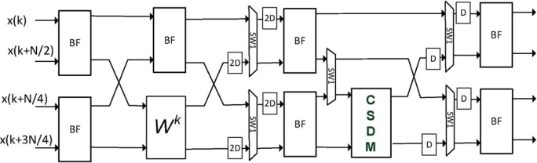
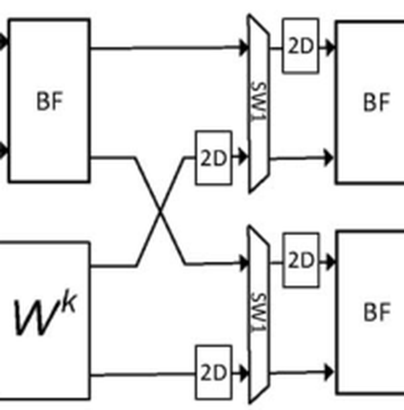
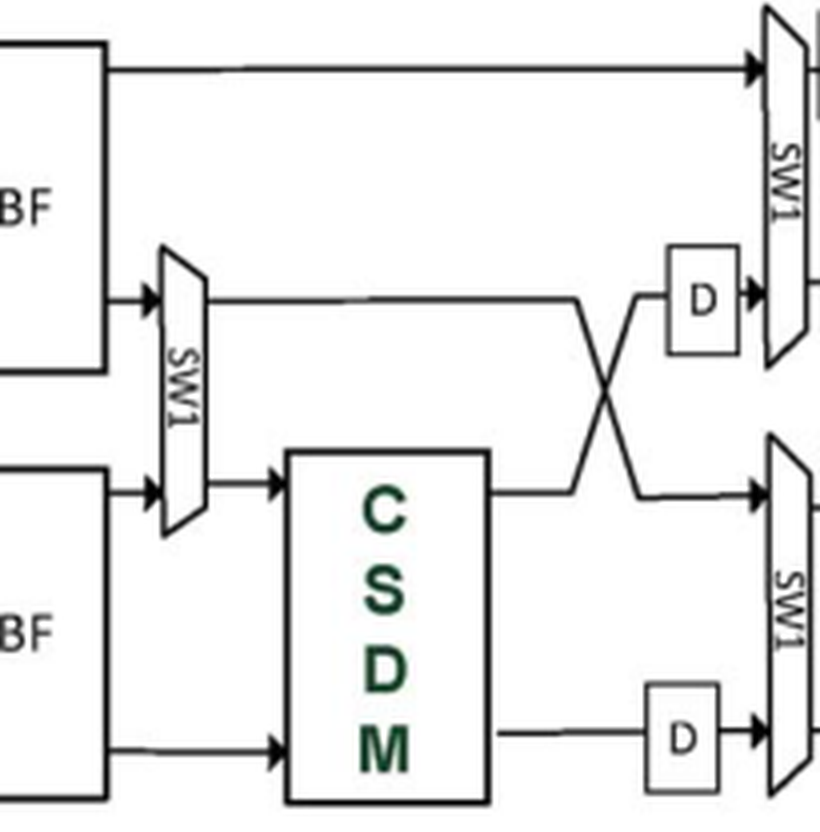
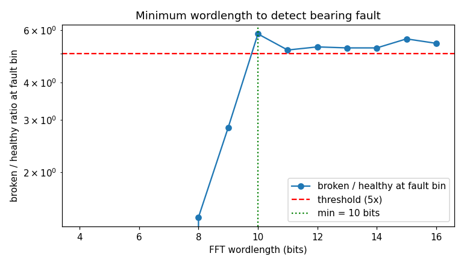
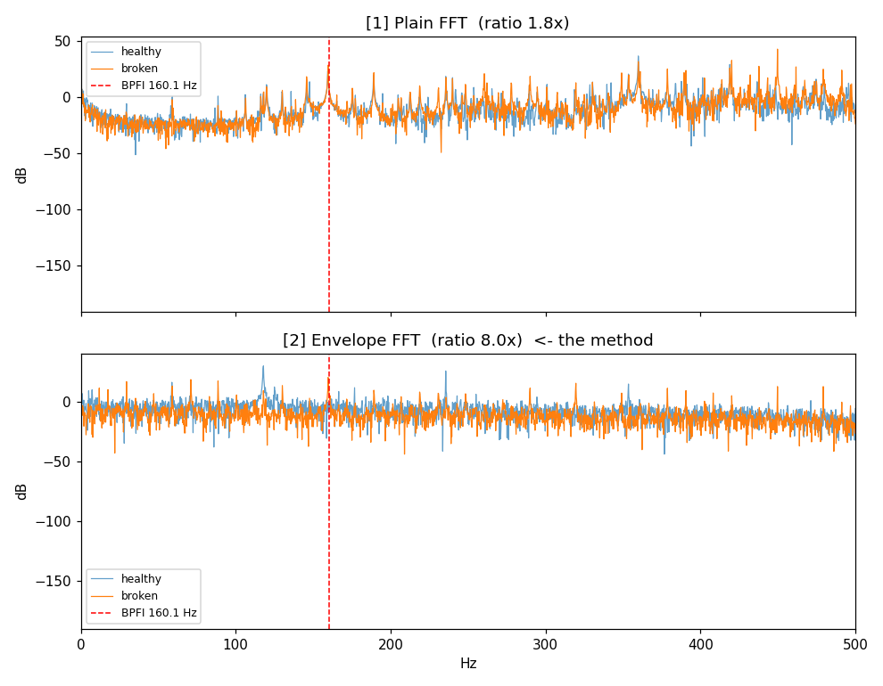

# Real_FFT — A 4-Parallel Pipelined Real-Valued FFT, in Verilog

**Hardware for the FFT of real-valued signals — derived from an IEEE paper, validated bit-exact in Python, and built stage by stage in synthesizable Verilog.**


---

Most FFT cores are built for complex input and then pointed at real-valued data anyway — throwing away roughly half the arithmetic they do, because a real signal's spectrum is Hermitian-symmetric and half the output is redundant. This repo builds a **real FFT (RFFT)** core that never does that wasted work in the first place: real datapaths, real butterflies, no unnecessary complex multipliers, following a real IEEE architecture paper column-by-column from block diagram to working RTL.

Every stage exists twice before it's trusted: once as a plain Python function checked against a floating-point reference, and once as fixed-point Verilog checked bit-exact (or within a stated tolerance) against that same Python output in a self-checking testbench. Nothing gets written in HDL on faith.

## Table of Contents

- [What is FFT and Why Real-Valued FFT](#what-is-fft-and-why-real-valued-fft)
- [The Journey From Paper to Pipeline](#the-journey-from-paper-to-pipeline)
- [The 2013 4-Parallel Architecture](#the-2013-4-parallel-architecture)
  - [Stage by Stage](#stage-by-stage)
  - [Resource Count](#resource-count)
- [Repository Structure](#repository-structure)
- [Validation Methodology](#validation-methodology)
  - [Debugging Highlights](#debugging-highlights)
- [Getting Started](#getting-started)
- [Real World Application: Bearing Fault Detection](#real-world-application-bearing-fault-detection)
- [Roadmap](#roadmap)
- [References](#references)

## What is FFT and Why Real-Valued FFT

The **Fast Fourier Transform (FFT)** turns a signal in time into its frequency spectrum — the operation underneath spectrum analyzers, communications receivers, audio/image compression, radar, and condition monitoring. The standard FFT is built for *complex* input and produces *complex* output.

Most real-world signals — a microphone, an accelerometer, a voltage sense line — are purely **real**-valued. Feed a real signal into a complex FFT and its output spectrum comes out **Hermitian-symmetric**: the upper half is just the mirror image (conjugate) of the lower half. A general-purpose complex FFT has no way to know that in advance, so it computes both halves anyway — roughly double the butterflies, rotators, and memory that are actually needed.

A **Real FFT (RFFT)** architecture is built knowing the input is real from the start, so it can restructure the flow graph — pushing twiddle factors around, splitting complex datapaths into separate real and imaginary ones — to eliminate that redundant half before it's ever computed. That's a genuinely different, more resource-efficient hardware design, not just a complex FFT with half the outputs thrown away afterward. It's exactly the kind of thing that matters in power- and area-constrained hardware: vibration/bearing-fault monitoring, biomedical signal processing, and communications front-ends all run FFTs on real-valued samples, all day, on a budget.

## The Journey From Paper to Pipeline

This project didn't start with the architecture it ends on. It started with **Garrido, Parhi & Grajal's 2009 paper**, *"A Pipelined FFT Architecture for Real-Valued Signals"* [2] — read closely enough to re-derive and model its algorithm directly in Python (`python/PaperImpl2009WithoutClass.py`, `python/2009architecture_N16.py`, `python/rfft16_dif_flowgraph.py`), stage by stage, cross-checked against `numpy.fft.rfft`, purely to build a real, working understanding of *how* a pipelined RFFT architecture is actually put together — the flow-graph transformations, the switch/delay shuffling, the resource-sharing tricks. No hardware was built from it; it was the training ground.

That understanding is what made **Salehi, Amirfattahi & Parhi's 2013 paper**, *"Pipelined Architectures for Real-Valued FFT and Hermitian-Symmetric IFFT With Real Datapaths"* [1], approachable as an actual hardware project: a 4-parallel, N=16, real-datapath-only pipelined RFFT. That 2013 architecture is what this repository implements in Verilog — the real deliverable, built column-by-column, one paper-figure stage at a time. The plan for later stages is to circle back and **optimize this architecture for efficiency** once it's functionally complete, the same way a first correctness-focused pass is normally followed by a resource-focused one.

## The 2013 4-Parallel Architecture

<p align="center">
  
</p>
<p align="center"><sub>Fig. 7 from Salehi, Amirfattahi &amp; Parhi (2013) [1] — the exact architecture this repository implements.</sub></p>

The architecture streams **4 real samples per clock cycle** through 4 pipeline columns, each built from the same three primitives: a real **BF** (butterfly) box that either adds/subtracts two reals or passes a real/imaginary pair straight through depending on a mode bit, a shared **Wᵏ** twiddle-rotator box, and **SW1** switches with delay lines that reshuffle samples in time so a handful of physical boxes can be reused across the whole 16-point frame instead of instantiating one box per flow-graph node.

### Stage by Stage

| Stage | Paper column | What happens | Hardware | Status |
|---|---|---|---|---|
| **1** | BF, BF | Two real butterflies split the incoming 4-sample set into sum/difference pairs across two lanes | 2 × BF | ✅ Built & verified |
| **2** | BF / Wᵏ | One more BF combines the two *sum* outputs; Eq.(7)'s sign-flip + the shared rotator combine the two *diff* outputs | 1 × BF + 1 × rotator (Wᵏ) | ✅ Built & verified |
| **3** | SW1+2D, BF, Wᵏ/CSDM | A shuffle network (switches + 2-deep delay lines) reorders live and 2-/4-cycle-old taps before they hit two more BFs and the shared rotator's Wᵏ=W² slot | 2 × BF + 1 × rotator (shared) + 3 × SW1 + 4 × 2-delay elements | ✅ Built & verified |
| **4** | SW1+D, BF | Final shallower shuffle (1-cycle delays) feeding the closing butterflies that produce X(k) | — | 🚧 Planned |

<p align="center">
  
  
</p>
<p align="center"><sub>Zoomed detail from Fig. 7 [1]: the Stage 2→3 shuffle network (left) and the Stage 3→4 CSDM merge (right) — this is the part worth zooming in on, see <a href="#debugging-highlights">Debugging Highlights</a> below.</sub></p>

Each `stageN.v` corresponds to exactly one paper column; cross-stage wiring lives in dedicated `topN_M.v` structural link modules (e.g. `top_stage1_stage2_stage3.v`), so any single stage can still be unit-tested by driving its ports directly.

### Resource Count

The paper's whole point is that a 4-parallel architecture needs only **one** physical rotator no matter how many twiddle factors the algorithm calls for, and only as many switches as there are genuine timing collisions — not one box per flow-graph node. Stages 1–3 already hit that: a single shared `rotator.v` instance serves every twiddle multiply across both Stage 2 and Stage 3, and Stage 3 needs exactly 3 `switch1` instances + 4 delay elements to match Fig. 6's own worked example, not the naive "one switch per candidate input" count.

The Wᵏ=W² slot in Stage 3 is currently a full fixed-point multiplier (`rotator.v`), where the paper notes it could instead be a canonical-signed-digit multiplier (CSDM) — a cheaper, multiplier-free implementation. That's a concrete target for the planned efficiency pass, not an oversight.

## Repository Structure

```
Real_FFT/
├── verilog/
│   └── rfft16_4parallel/        # the hardware project: 2013 4-parallel N=16 RFFT
│       ├── rtl/                 # synthesizable Verilog: real_bf, rotator, switch1, stage1-3, top-level links
│       ├── tb/                  # self-checking testbenches, one per stage + structural links
│       └── Makefile              # make STAGE=1 / 2 / 3 / top12 / top123 / timed
├── python/                      # golden models + verification
│   ├── 2013architecture_N16_4parallel.py   # reference algorithm this Verilog implements
│   ├── verify/                              # bit-exact schedule derivation/verification scripts
│   ├── bearing_fault_demo/                  # applied RFFT case study, see below
│   ├── 2009architecture_N16.py              # 2009 paper, modeled in Python only (see "The Journey")
│   ├── PaperImpl2009WithoutClass.py         # "
│   └── rfft16_dif_flowgraph.py              # "
├── matlab/
│   └── rfft16_dif_flowgraph.m   # MATLAB twin of the 2009 flow-graph Python model
└── docs/images/                  # figures referenced in this README
```

## Validation Methodology

Nothing gets ported to Verilog before it's proven correct in software:

1. **Derive & validate in Python first.** Each stage is written as a plain Python function against the paper's equations, checked against a floating-point reference (`numpy.fft.rfft` or the previous stage's own validated output) before any RTL exists.
2. **Port to fixed-point Verilog.** Each `stageN.v` is an explicit hardware twin of its Python counterpart — same variable names, same structure, comments cross-referencing the exact Python lines it mirrors.
3. **Self-checking testbenches.** Every `tb_stageN.v` streams a fixed test vector through the DUT and compares its output against golden values generated by the *same* validated Python model — not re-derived by hand a second time, which is exactly where transcription bugs like to hide.
4. **Full regression after every change.** All Makefile targets (`STAGE=1/2/3/top12/top123/timed`) are re-run after any RTL edit; an unchanged error figure across a structural refactor is itself evidence the refactor was value-preserving, not just "it still compiles."

### Debugging Highlights

Two real bugs this process actually caught, worth calling out because neither would have shown up from just reading the code:

> **The `cos(0) = +1.0` fixed-point trap.** In signed Q1.(W−1) fixed point, the maximum representable value is `1 − 2⁻⁽ᵂ⁻¹⁾` — exactly `+1.0` has no representation and silently wraps to `−1.0` in two's complement if you don't catch it. Caught by testing `rotator.v` standalone, *before* `stage2.v` (its first caller) was even written, and fixed by explicitly clamping that one coefficient to the maximum representable value instead of letting it wrap.

> **The Stage 3 shuffle topology.** An early version of `stage3.v` reached bit-exact agreement with the golden model using 5 switches and a delay-line arrangement that put both of one signal's delays *before* its switch. It worked — and was still wrong: cross-checked against Fig. 6's own worked numeric example, the paper's actual topology needs each switch sandwiched *between* two 2-deep delays, using exactly 3 switches total. The fix was hand-traced cycle-by-cycle before touching code, then applied — full regression re-run afterward showed *identical* error figures to the broken version, which is precisely what proves a topology fix changed the wiring, not the answer.

## Getting Started

Requires **Xilinx Vivado** (`xvlog`/`xelab`/`xsim` — the Makefile assumes `F:\Vivado\2025.1\Vivado\bin`; edit `VIVADO_BIN` at the top of the Makefile if yours lives elsewhere) and **Python 3** with `numpy` for the golden models.

```bash
cd verilog/rfft16_4parallel

make STAGE=1        # Stage 1 self-checking testbench
make STAGE=2        # Stage 1 -> 2
make STAGE=3        # Stage 1 -> 2 -> 3 (current default)
make STAGE=top123   # same pipeline via the structural top-level link module
make STAGE=timed    # simple explicit-timeline testbench, easiest to read against a waveform
make STAGE=3 wave   # open the same run in the xsim GUI
```

```bash
# regenerate / inspect the golden models and derived constants
python python/2013architecture_N16_4parallel.py
python python/verify/gen_stage34_schedule.py         # derives + verifies the Stage 3/4 schedule bit-exact
python python/gen_twiddle_master_4parallel.py         # regenerates the fixed-point twiddle constants stage2.v/stage3.v hardcode
```

## Real World Application: Bearing Fault Detection

The RFFT isn't just an academic exercise here — `python/bearing_fault_demo/` runs the same real-FFT approach on real CWRU bearing vibration data to detect an inner-race fault from its spectral signature, and answers a question directly relevant to this hardware project: **how few fixed-point bits can you get away with before the fault signature disappears?**

<p align="center">
  
</p>
<p align="center"><sub>Sweeping FFT wordlength against a fixed detection threshold — 10 bits is the minimum that reliably separates a broken bearing from a healthy one on this dataset.</sub></p>

<p align="center">
  
</p>
<p align="center"><sub>Plain FFT gives a 1.8x broken/healthy ratio at the fault frequency; envelope-detection first boosts that to 8.0x — the same kind of signal-processing-before-hardware thinking this whole repo is built around.</sub></p>

## Roadmap

- [ ] **Stage 4** — the final shuffle + closing butterfly stage; not yet started.
- [ ] **Efficiency optimization pass** on the 4-parallel architecture once it's functionally complete (e.g. replacing Stage 3's shared multiplier with the paper's proposed CSDM for the W² slot).
- [ ] **Real Vivado synthesis numbers** (LUT/FF/DSP, Fmax) for this architecture, once all 4 stages exist.
- [ ] **SQNR sweep across `WIDTH`**, the same fixed-point-budget question `bearing_fault_demo/SqnrSweep.py` already answers for the applied use case, run here against this core directly.

## References

1. S. A. Salehi, R. Amirfattahi, and K. K. Parhi, "Pipelined Architectures for Real-Valued FFT and Hermitian-Symmetric IFFT With Real Datapaths," *IEEE Transactions on Circuits and Systems II: Express Briefs*, vol. 60, no. 8, pp. 507–511, Aug. 2013. — **the paper this repository implements in Verilog.**
2. M. Garrido, K. K. Parhi, and J. Grajal, "A Pipelined FFT Architecture for Real-Valued Signals," *IEEE Transactions on Circuits and Systems I: Regular Papers*, vol. 56, no. 12, pp. 2634–2643, Dec. 2009. — studied first and modeled in Python only (see [The Journey](#the-journey-from-paper-to-pipeline)), to build the understanding that made [1] approachable as a hardware project.
